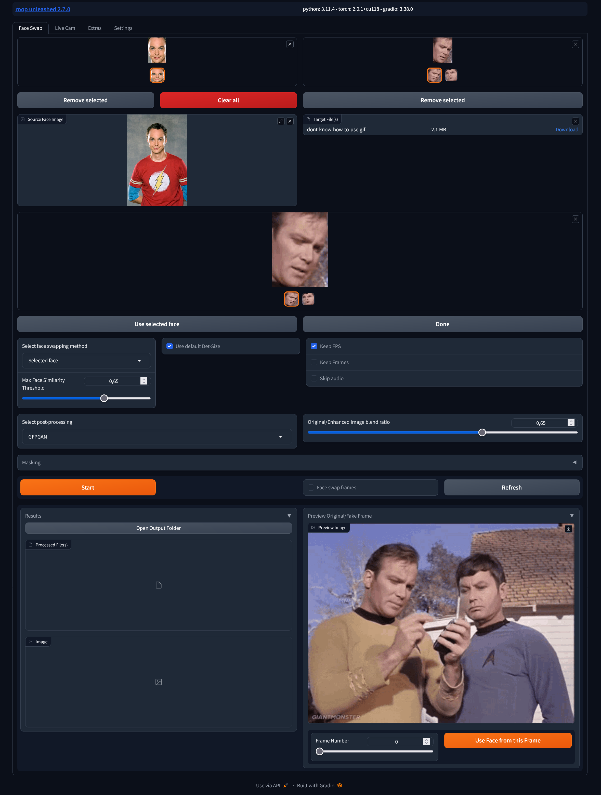

# roop-unleashed

[Cambios](#cambios) • [Instalación](#instalación) • [Uso](#uso) • [Ejemplo](#ejemplo) • [Preguntas frecuentes](#faq)

Deepfakes sin censura para imágenes y videos sin entrenamiento y una interfaz gráfica de usuario fácil de usar.

### Características

- Interfaz gráfica de usuario independiente de la plataforma del navegador
- Selección de múltiples caras de entrada/salida de una sola vez
- Muchos modos de intercambio diferentes, primeras detecciones, selecciones de caras, por género
- Procesamiento por lotes de imágenes/videos
- Enmascaramiento de obstrucciones faciales utilizando indicaciones de texto
- Restauración opcional de caras mediante diferentes mejoradores
- Vista previa de intercambio desde diferentes fotogramas de video
- Fake Cam en vivo utilizando tu cámara web
- Pestaña de extras para cortar videos, etc.
- Configuraciones: almacenamiento de configuración para la próxima sesión
- Soporte para temas

¡Y mucho más...

## Descargo de responsabilidad

Este proyecto es solo para uso técnico y académico. Se espera que los usuarios de este software utilicen el software de manera responsable cumpliendo con la ley local. Si se utiliza la cara de una persona real, se sugiere que los usuarios obtengan el consentimiento de la persona involucrada y mencionen claramente que es un deepfake al publicar contenido en línea. Los desarrolladores de este software no serán responsables de las acciones de los usuarios finales.
**Por favor, no lo apliques en situaciones ilegales e inmorales.**

En caso de violación de los requisitos legales y éticos del país o región del usuario, este repositorio de código está exento de responsabilidad.

### Instalación

> Para Windows, necesitas descargar e instalar [Visual Studio](https://visualstudio.microsoft.com/de/downloads/) (teóricamente, las herramientas de compilación podrían funcionar también, pero en mi experiencia hasta ahora no lo hacen). Durante la instalación, asegúrate de incluir el paquete de C++.

Además de eso, simplemente usa el instalador de un clic en las versiones. Esto descargará e instalará todo en un entorno conda práctico. Esto no solo instala la aplicación sino que también la ejecuta, una vez instalada.

Para otros sistemas operativos o si sabes lo que estás haciendo:

- `git clone https://github.com/C0untFloyd/roop-unleashed`
- preferiblemente, crea un entorno virtual o un entorno conda
- `cd roop-unleashed`
- `pip install -r requirements.txt`

Dependiendo de la GPU disponible, es posible que necesites instalar paquetes adicionales. Aquí tienes las instrucciones de la página original de roop:

[Usar aceleración de GPU](https://github.com/s0md3v/roop/wiki/2.-Acceleration)

El proveedor de GPU utilizado se configura en la pestaña de configuración, no es necesario utilizar argumentos de línea de comandos. El valor predeterminado es CUDA (para NVIDIA). Si lo cambias, reinicia completamente roop-unleashed para permitir la recarga del modelo.

Para el intercambio de caras en video, también necesitas tener ffmpeg instalado correctamente (teniéndolo en tu variable de entorno PATH). El instalador de Windows intenta hacer esto automáticamente.

### Uso

- Windows: ejecuta `windows_run.bat` desde el instalador.
- Linux: `python run.py`

Los argumentos adicionales de la línea de comandos no son compatibles actualmente y la configuración debe realizarse mediante la interfaz de usuario.

> Nota: Cuando ejecutas este programa por primera vez, descargará algunos modelos de aproximadamente ~2 GB de tamaño.

### Ejemplo

*Próximamente*

### Cambios

**11.8.2023** v2.7.0

Versión inicial de Gradio: la antigua versión de TkInter ahora está obsoleta

- Reagregado relleno unificado a los mejoradores faciales
- Corregido DMDNet para todas las resoluciones
- La selección de la cara objetivo ahora cambia automáticamente el modo de intercambio a seleccionado
- Los proveedores de GPU se configuran correctamente mediante la GUI (necesita reinicio actualmente)
- La carpeta de salida local se puede abrir desde la página
- Funciones extras inacabadas deshabilitadas por ahora
- El instalador verifica un compromiso específico, permitiendo volver a la primera instalación
- Actualizado el readme para la nueva versión de Gradio
- Actualizado Colab

# Reconocimientos

Muchas ideas, código o modelos preentrenados utilizados de los siguientes proyectos:

https://github.com/deepinsight/insightface
https://github.com/s0md3v/roop
https://github.com/AUTOMATIC1111/stable-diffusion-webui
https://github.com/Hillobar/Rope
https://github.com/janvarev/chain-img-processor
https://github.com/TencentARC/GFPGAN   
https://github.com/kadirnar/codeformer-pip
https://github.com/csxmli2016/DMDNet

Gracias a todos los desarrolladores!
